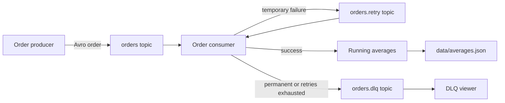

# Kafka Avro Order Processing System

This repository is a complete implementation of the Chapter 3 assignment. It
produces and consumes Avro-encoded order messages with Apache Kafka, calculates
real-time running price averages, retries temporary failures, and routes
permanent failures to a Dead Letter Queue (DLQ).

## What the system demonstrates

- An order producer that generates randomized prices.
- Binary Avro serialization using the required `order.avsc` fields.
- Real-time overall and per-product running averages.
- Exponential-backoff retry handling for temporary failures.
- Direct DLQ routing for permanent failures.
- DLQ routing when temporary retries are exhausted.
- Manual Kafka offset commits after processing or successful rerouting.
- Persistent, duplicate-aware aggregate state across consumer restarts.
- A DLQ viewer that decodes the failed Avro order and its failure metadata.
- Automated tests and a GitHub Actions test workflow.

## Architecture



Kafka message values remain Avro order records throughout the main, retry, and
DLQ paths. Retry counts and failure details are stored in Kafka headers, so the
assignment's three-field order contract is not changed.

## Prerequisite

Install and start Docker Desktop. No local Kafka, Java, or Python installation
is needed for the demonstration.

The project pins the official `apache/kafka-native:4.3.1` local-development
image and current compatible Python packages. The Kafka container runs as a
single-node KRaft broker, which is appropriate for an assignment demonstration.

## Fastest demonstration on Windows

From PowerShell in the repository directory, run:

```powershell
powershell -ExecutionPolicy Bypass -File .\scripts\demo.ps1
```

The script builds the application, starts Kafka and the consumer, publishes ten
orders, waits for retry processing, prints the consumer log, and displays the
permanently failed order from the DLQ.

When finished:

```powershell
.\scripts\stop.ps1
```

## Manual live demonstration

Use two terminals so the behavior is visible in real time.

### Terminal 1 - start the system and follow the consumer

```powershell
docker compose up -d --build broker topic-init consumer
docker compose logs -f consumer
```

Wait until the consumer prints `Consumer ready`.

### Terminal 2 - produce the demonstration orders

```powershell
docker compose run --rm producer --count 10 --interval 0.35 --demo
```

The `--demo` option sends eight normal orders followed by:

- `TEMPORARY_FAILURE`: fails twice, is placed on `orders.retry` twice, and then
  succeeds on attempt 2.
- `PERMANENT_FAILURE`: fails immediately and is placed on `orders.dlq`.

Terminal 1 will show `PROCESSED`, `RETRY scheduled`, `RETRY published`, and
`DLQ published` messages. Nine of the ten orders ultimately contribute to the
average. The permanently failed order does not affect the aggregate.

### Inspect the DLQ

```powershell
docker compose run --rm dlq-viewer --max-messages 1 --timeout 15
```

The result includes the decoded order and headers such as `failure-type`,
`error-message`, `retry-attempt`, `original-topic`, and `failed-at`.

### Stop or fully reset

Stop containers without removing them:

```powershell
docker compose stop
```

For a completely fresh demonstration, remove the containers and then delete
the persisted aggregate file:

```powershell
docker compose down
Remove-Item .\data\averages.json -ErrorAction SilentlyContinue
```

## Automated tests

To run tests outside Docker, create a Python virtual environment and install
`requirements-dev.txt`, then run:

```powershell
python -m pytest
```

The tests cover Avro round trips and validation, overall and per-product
averages, persistence, duplicate protection, temporary/permanent failure
classification, retry metadata, and demonstration batch generation.

## Configuration

All runtime settings can be changed with environment variables. Defaults are
listed in `.env.example`:

- `BOOTSTRAP_SERVERS`: Kafka address; default `localhost:9092`.
- `ORDERS_TOPIC`: main topic; default `orders`.
- `RETRY_TOPIC`: retry topic; default `orders.retry`.
- `DLQ_TOPIC`: dead letter topic; default `orders.dlq`.
- `CONSUMER_GROUP`: consumer group; default `order-processor-v1`.
- `MAX_RETRIES`: maximum retry publications; default `3`.
- `RETRY_BACKOFF_SECONDS`: initial backoff; default `1` second.
- `TEMPORARY_FAILURES_BEFORE_SUCCESS`: simulated failures; default `2`.
- `STATE_FILE`: persistent aggregate state; default `data/averages.json`.

## Repository layout

- `order.avsc` - the assignment's required Avro schema.
- `order_pipeline/producer.py` - randomized and demo order producer.
- `order_pipeline/consumer.py` - processing, retries, DLQ, and commits.
- `order_pipeline/aggregation.py` - persistent running averages.
- `order_pipeline/serialization.py` - strict Avro validation and encoding.
- `order_pipeline/dlq_viewer.py` - readable inspection of failed orders.
- `order_pipeline/init_topics.py` - broker readiness and topic creation.
- `compose.yaml` - Kafka and all application services.
- `tests/` - automated unit tests.
- `docs/ASSIGNMENT_REPORT.md` - ready-to-submit technical report.
- `docs/DEMO_CHECKLIST.md` - short presentation checklist.

## Reliability decisions

Messages are keyed by `orderId`. The producer uses Kafka's idempotent producer
mode and waits for broker acknowledgements. The consumer disables automatic
commits and commits only after a message is processed or successfully published
to the retry/DLQ topic. Persistent processed-order IDs prevent the aggregate
from double-counting an order following redelivery.

This is an at-least-once teaching implementation. A production system could use
Kafka transactions for atomic consume-transform-produce behavior, a distributed
state store for multiple consumer replicas, and monitoring/alerting for the DLQ.

## References

- [Apache Kafka downloads and official Docker images](https://kafka.apache.org/community/downloads/)
- [Apache Kafka official single-node Docker Compose example](https://github.com/apache/kafka/blob/trunk/docker/examples/docker-compose-files/single-node/plaintext/docker-compose.yml)
- [Confluent Kafka Python client](https://pypi.org/project/confluent-kafka/)
- [fastavro](https://pypi.org/project/fastavro/)
