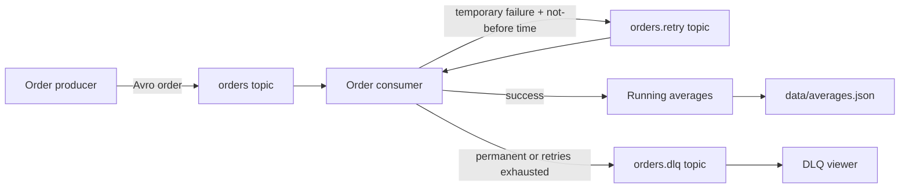

# Kafka Avro Order Processing System

[](https://github.com/TM-threemavithana/kafka-avro-order-processing-system/actions/workflows/tests.yml)

- **Student:** Threemavithana T.M.
- **Registration number:** EG/2021/4835
- **Module:** EC8208 - Big Data Analytics
- **Assessment:** Continuous Assessment 02 - Take Home Assignment

This repository implements a Kafka-based order-processing pipeline. It produces
and consumes binary Avro order messages, calculates real-time running price
averages, retries temporary failures, and routes permanent or retry-exhausted
failures to a dead-letter queue (DLQ).

## What the system demonstrates

- An order producer that generates randomized prices.
- Binary Avro serialization using the required `order.avsc` fields.
- Real-time overall and per-product running averages.
- Exponential-backoff retry handling for temporary failures.
- Direct DLQ routing for permanent failures.
- DLQ routing when temporary retries are exhausted.
- Manual Kafka offset commits after processing or successful rerouting.
- Persistent, duplicate-aware aggregate state across consumer restarts.
- Safe rejection of conflicting records that reuse an existing `orderId`.
- A DLQ viewer that decodes the failed Avro order and its failure metadata.
- Automated tests and a GitHub Actions test workflow.

## Architecture



Kafka message values remain Avro order records throughout the main, retry, and
DLQ paths. Retry counts and failure details are stored in Kafka headers, so the
assignment's three-field order contract is not changed.

## Verified demonstration result

The reproducible demonstration uses `--seed 42` and publishes ten orders:

- Eight normal orders are processed immediately.
- One `TEMPORARY_FAILURE` order fails twice and succeeds on retry attempt 2.
- One `PERMANENT_FAILURE` order is sent directly to `orders.dlq`.
- Nine successful orders contribute to the aggregate.
- The final overall average is `197.86`.
- All 39 automated tests pass.
- GitHub Actions passes both `unit-tests` and `kafka-integration`.

## Prerequisite

Install and start Docker Desktop. No local Kafka, Java, or Python installation
is needed for the Docker-based demonstration. Python 3.11 or later is required
only when running the tests directly on the host.

The project pins the official `apache/kafka-native:4.3.1` local-development
image and compatible Python package versions. The Kafka container runs as a
single-node KRaft broker, which is appropriate for an assignment demonstration.

## Fastest demonstration on Windows

From PowerShell in the repository directory, run:

```powershell
powershell -ExecutionPolicy Bypass -File .\scripts\demo.ps1
```

The script builds the application, starts Kafka and the consumer, publishes ten
orders, waits for retry processing, prints the consumer log, and displays the
permanently failed order from the DLQ.

When finished:

```powershell
.\scripts\stop.ps1
```

## Manual live demonstration

Use two terminals so the behavior is visible in real time.

### Terminal 1 - start the system and follow the consumer

```powershell
docker compose up -d --build broker topic-init consumer
docker compose ps
docker compose logs topic-init
docker compose logs -f consumer
```

The topic initializer output should list `orders`, `orders.retry`, and
`orders.dlq`. Wait until the consumer prints `Consumer ready`.

### Terminal 2 - produce the demonstration orders

```powershell
docker compose run --rm producer --count 10 --interval 0.35 --seed 42 --demo
```

The `--demo` option sends eight normal orders followed by:

- `TEMPORARY_FAILURE`: fails twice, is placed on `orders.retry` twice, and then
  succeeds on attempt 2.
- `PERMANENT_FAILURE`: fails immediately and is placed on `orders.dlq`.

Terminal 1 will show `PROCESSED`, `RETRY scheduled`, `RETRY published`, and
`DLQ published` messages. Nine of the ten orders ultimately contribute to the
average. The permanently failed order does not affect the aggregate.

### Inspect the DLQ

```powershell
docker compose run --rm dlq-viewer --max-messages 1 --timeout 15
```

The result includes the decoded order and headers such as `failure-type`,
`error-message`, `retry-attempt`, `original-topic`, and `failed-at`.

### Stop or fully reset

Stop containers without removing them:

```powershell
docker compose stop
```

For a completely fresh demonstration, remove the containers and then delete
the persisted aggregate file:

```powershell
docker compose down
Remove-Item .\data\averages.json -ErrorAction SilentlyContinue
```

## Automated tests

Python 3.11 or later is required for local testing. From PowerShell in the
repository directory, create an isolated virtual environment, install the
development dependencies, and run the test suite:

```powershell
python -m venv .venv
.\.venv\Scripts\python.exe -m pip install --upgrade pip
.\.venv\Scripts\python.exe -m pip install --requirement requirements-dev.txt
.\.venv\Scripts\python.exe -m pytest
```

The expected result is `39 passed`. The tests cover Avro round trips and
validation, overall and per-product averages, persistence, duplicate
protection, temporary and permanent failure classification, retry timing,
non-blocking deferral, and demonstration batch generation. GitHub Actions also
runs `scripts/integration-test.ps1` against a real Kafka broker to verify
aggregation, retry success, and the DLQ end to end.

## Continuous integration and repository evidence

The workflow in `.github/workflows/tests.yml` runs for pushes and pull requests:

- `unit-tests` installs the development requirements and runs
  `python -m pytest`.
- `kafka-integration` starts the Docker-based Kafka system and verifies nine
  aggregated orders, temporary-failure recovery, and one permanent DLQ record.

Both jobs must show a green successful status before submission. To display the
latest repository history and confirm that no local files are waiting to be
committed, run:

```powershell
git log --oneline -5
git status --short
```

`git log` provides version-control evidence. An empty `git status --short`
result means the working tree is clean.

## Configuration

Runtime settings are read from environment variables. The host defaults below
match `.env.example`; Docker Compose overrides `BOOTSTRAP_SERVERS` with
`broker:19092` and `STATE_FILE` with `/app/data/averages.json`.

| Variable | Default | Purpose |
| --- | --- | --- |
| `BOOTSTRAP_SERVERS` | `localhost:9092` | Kafka broker address used outside Docker |
| `ORDERS_TOPIC` | `orders` | Main topic for new orders |
| `RETRY_TOPIC` | `orders.retry` | Topic for temporary failures awaiting retry |
| `DLQ_TOPIC` | `orders.dlq` | Topic for permanent or retry-exhausted failures |
| `CONSUMER_GROUP` | `order-processor-v1` | Consumer group identifier |
| `MAX_RETRIES` | `3` | Maximum number of retry publications |
| `RETRY_BACKOFF_SECONDS` | `1` | Initial retry delay in seconds |
| `TEMPORARY_FAILURE_PRODUCT` | `TEMPORARY_FAILURE` | Product name used to simulate a recoverable failure |
| `PERMANENT_FAILURE_PRODUCT` | `PERMANENT_FAILURE` | Product name used to simulate a permanent failure |
| `TEMPORARY_FAILURES_BEFORE_SUCCESS` | `2` | Number of simulated failures before recovery |
| `STATE_FILE` | `data/averages.json` | Persisted aggregate-state file |

## Repository layout

### Project configuration

- `order.avsc` — required Avro `Order` schema.
- `compose.yaml` — Kafka broker and application services.
- `Dockerfile` — shared Python application image.
- `.env.example` — documented host-side configuration defaults.
- `requirements.txt` — runtime dependencies.
- `requirements-dev.txt` — runtime and test dependencies.

### Application package

- `order_pipeline/producer.py` — randomized and reproducible demonstration
  order producer.
- `order_pipeline/consumer.py` — validation, aggregation, retry/DLQ routing,
  and manual offset commits.
- `order_pipeline/aggregation.py` — duplicate-aware persisted running
  averages.
- `order_pipeline/serialization.py` — strict Avro validation, encoding, and
  decoding.
- `order_pipeline/dlq_viewer.py` — decoded DLQ order and failure-header
  inspection.
- `order_pipeline/init_topics.py` — broker readiness check and creation of
  the three application topics.

### Demonstration and automation

- `scripts/demo.ps1` and `scripts/demo.sh` — complete demonstration runners
  for Windows and Unix-like shells.
- `scripts/stop.ps1` — Docker service shutdown.
- `scripts/integration-test.ps1` and `scripts/integration-test.sh` —
  end-to-end Kafka verification.
- `.github/workflows/tests.yml` — unit-test and Kafka-integration CI jobs.

### Tests and documentation

- `tests/` — 39 automated tests.
- `docs/ASSIGNMENT_REPORT.md` — technical assignment report.
- `docs/DEMO_CHECKLIST.md` — presentation and live-demonstration checklist.

## Reliability decisions

Messages are keyed by `orderId`. The producer uses Kafka's idempotent producer
mode and waits for broker acknowledgements. The consumer disables automatic
commits and commits only after a message is processed or successfully published
to the retry/DLQ topic. Persistent processed-order IDs prevent the aggregate
from double-counting an order following redelivery. Retry messages include a
not-before timestamp; the consumer pauses only the affected retry partition
until it becomes due, allowing unrelated orders to continue processing.

This is an at-least-once teaching implementation. A production system could use
Kafka transactions for atomic consume-transform-produce behavior, a distributed
state store for multiple consumer replicas, and monitoring/alerting for the DLQ.

## References

- [Apache Kafka documentation](https://kafka.apache.org/documentation/)
- [Apache Kafka downloads](https://kafka.apache.org/downloads)
- [Confluent Kafka Python client](https://docs.confluent.io/kafka-clients/python/current/overview.html)
- [Apache Avro specification](https://avro.apache.org/docs/current/specification/)
- [fastavro documentation](https://fastavro.readthedocs.io/)
- [Docker Compose documentation](https://docs.docker.com/compose/)
