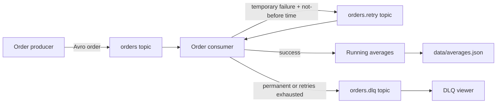

# Live Demonstration Evidence

**Student:** Threemavithana T.M.  
**Registration number:** EG/2021/4835  
**Project:** Kafka Avro Order Processing System  
**Execution time:** 2026-09-09 23:33:36 Sri Lanka Standard Time

## Verified result

- Docker services built and started successfully.
- Ten Avro orders were published.
- Eight normal orders were processed immediately.
- The temporary-failure order was retried twice and then processed successfully.
- The permanent-failure order was published directly to `orders.dlq`.
- Final aggregate count: **9**.
- Final overall average: **197.86**.
- Automated tests: **39 passed**.

## 1. Avro schema

```json
{
  "type": "record",
  "name": "Order",
  "namespace": "lk.assignment.orders",
  "doc": "A purchase transaction sent through the Kafka order pipeline.",
  "fields": [
    {
      "name": "orderId",
      "type": "string",
      "doc": "Unique identifier for the order"
    },
    {
      "name": "product",
      "type": "string",
      "doc": "Name of the purchased item"
    },
    {
      "name": "price",
      "type": "float",
      "doc": "Price of the product"
    }
  ]
}
```

## 2. README architecture



## 3. Docker startup

**Command**

```powershell
docker compose up -d --build broker topic-init consumer
```

```text
#1 [internal] load local bake definitions
#1 reading from stdin 1.02kB done
#1 DONE 0.0s

#2 [consumer internal] load build definition from Dockerfile
#2 transferring dockerfile: 325B 0.0s done
#2 DONE 0.0s

#3 [auth] library/python:pull token for registry-1.docker.io
#3 DONE 0.0s

#4 [consumer internal] load metadata for docker.io/library/python:3.13-slim
#4 DONE 2.7s

#5 [topic-init internal] load .dockerignore
#5 transferring context: 149B done
#5 DONE 0.0s

#6 [consumer internal] load build context
#6 transferring context: 1.46kB done
#6 DONE 0.0s

#7 [consumer 1/6] FROM docker.io/library/python:3.13-slim@sha256:9d2e5553305c7c7b0097999bb17187c69b921ccd6bc9d40e4bb5ebe652c00285
#7 resolve docker.io/library/python:3.13-slim@sha256:9d2e5553305c7c7b0097999bb17187c69b921ccd6bc9d40e4bb5ebe652c00285 0.0s done
#7 DONE 0.0s

#8 [topic-init 2/6] WORKDIR /app
#8 CACHED

#9 [topic-init 3/6] COPY requirements.txt ./
#9 CACHED

#10 [topic-init 5/6] COPY order.avsc ./
#10 CACHED

#11 [topic-init 4/6] RUN pip install --no-cache-dir --requirement requirements.txt
#11 CACHED

#12 [topic-init 6/6] COPY order_pipeline ./order_pipeline
#12 CACHED

#13 [consumer] exporting to image
#13 exporting layers done
#13 exporting manifest sha256:504011bf7e3c93bd0d1e686d3c9621ee6f85b05b566abbced62b383b66baa7d8 done
#13 exporting config sha256:5783d273f3b801dd490c39320ae2f757cb7850ca98046afd924d02f64eabb99e
#13 exporting config sha256:5783d273f3b801dd490c39320ae2f757cb7850ca98046afd924d02f64eabb99e done
#13 exporting attestation manifest sha256:c695cc5673ded0fe9356ae79f34296b3885b5f514f2d14f4c9307ee01fbfaab6
#13 ...

#14 [topic-init] exporting to image
#14 exporting layers done
#14 exporting manifest sha256:5f793be74832bced2e71083cfee94197c4eb2cc149a51990758bac6e770dc566 done
#14 exporting config sha256:876fc05c890ba28dbd1ee990d96f9277a9b50f6247c4893c2af1ea60b827b3ea done
#14 exporting attestation manifest sha256:213bdcb27ab7ac81c0e3ed02e945a1d834952fe52abb5b5ebb4edce17cfafc41 0.1s done
#14 exporting manifest list sha256:3b86bf4fed02947b2d0d69ecc3da6ae8d19fca67a7711e9c1da7532c0ca46306 0.0s done
#14 naming to docker.io/library/kafka-order-assignment-topic-init:latest 0.0s done
#14 unpacking to docker.io/library/kafka-order-assignment-topic-init:latest 0.0s done
#14 DONE 0.3s

#13 [consumer] exporting to image
#13 exporting attestation manifest sha256:c695cc5673ded0fe9356ae79f34296b3885b5f514f2d14f4c9307ee01fbfaab6 0.1s done
#13 exporting manifest list sha256:4449052f8fa0520a6e62f8e891e20e1d6ffb4be3416a282d09f2e0a40275b49b 0.0s done
#13 naming to docker.io/library/kafka-order-assignment-consumer:latest done
#13 unpacking to docker.io/library/kafka-order-assignment-consumer:latest 0.0s done
#13 DONE 0.3s

#15 [topic-init] resolving provenance for metadata file
#15 DONE 0.0s

#16 [consumer] resolving provenance for metadata file
#16 DONE 0.0s
 Image kafka-order-assignment-topic-init Building 
 Image kafka-order-assignment-consumer Building 
 Image kafka-order-assignment-topic-init Built 
 Image kafka-order-assignment-consumer Built 
 Network kafka-order-assignment_default Creating 
 Network kafka-order-assignment_default Created 
 Container kafka-order-assignment-broker-1 Creating 
 Container kafka-order-assignment-broker-1 Created 
 Container kafka-order-assignment-topic-init-1 Creating 
 Container kafka-order-assignment-topic-init-1 Created 
 Container kafka-order-assignment-consumer-1 Creating 
 Container kafka-order-assignment-consumer-1 Created 
 Container kafka-order-assignment-broker-1 Starting 
 Container kafka-order-assignment-broker-1 Started 
 Container kafka-order-assignment-topic-init-1 Starting 
 Container kafka-order-assignment-topic-init-1 Started 
 Container kafka-order-assignment-topic-init-1 Waiting 
 Container kafka-order-assignment-topic-init-1 Exited 
 Container kafka-order-assignment-consumer-1 Starting 
 Container kafka-order-assignment-consumer-1 Started
```

**Consumer readiness**

```text
consumer-1  | Consumer ready | topics=orders,orders.retry group=order-processor-v1 max_retries=3
```

## 4. Producer demonstration batch

**Command**

```powershell
docker compose run --rm producer --count 10 --interval 0.35 --seed 42 --demo
```

```text
Producing 10 Avro orders to 'orders' via broker:19092
PRODUCED orderId=1788977030209-0001 product=Item1 price=22.26
PRODUCED orderId=1788977030209-0002 product=Item3 price=130.00
PRODUCED orderId=1788977030209-0003 product=Item2 price=370.87
PRODUCED orderId=1788977030209-0004 product=Item1 price=299.34
PRODUCED orderId=1788977030209-0005 product=Item1 price=24.60
PRODUCED orderId=1788977030209-0006 product=Item2 price=124.00
PRODUCED orderId=1788977030209-0007 product=Item1 price=285.01
PRODUCED orderId=1788977030209-0008 product=Item4 price=118.02
PRODUCED orderId=1788977030209-0009 product=TEMPORARY_FAILURE price=406.62
PRODUCED orderId=1788977030209-0010 product=PERMANENT_FAILURE price=381.82
Producer finished successfully.
 Container kafka-order-assignment-broker-1 Running 
 Container kafka-order-assignment-topic-init-1 Starting 
 Container kafka-order-assignment-topic-init-1 Started 
 Container kafka-order-assignment-topic-init-1 Waiting 
 Container kafka-order-assignment-topic-init-1 Exited 
 Container kafka-order-assignment-producer-run-b90cc64fbd35 Creating 
 Container kafka-order-assignment-producer-run-b90cc64fbd35 Created
```

## 5. Consumer processing, retry, and DLQ evidence

```text
consumer-1  | Consumer ready | topics=orders,orders.retry group=order-processor-v1 max_retries=3
consumer-1  | PROCESSED orderId=1788977030209-0001 product=Item1 price=22.26 | overall: count=1 average=22.26 | Item1: count=1 average=22.26
consumer-1  | PROCESSED orderId=1788977030209-0002 product=Item3 price=130.00 | overall: count=2 average=76.13 | Item3: count=1 average=130.00
consumer-1  | PROCESSED orderId=1788977030209-0003 product=Item2 price=370.87 | overall: count=3 average=174.38 | Item2: count=1 average=370.87
consumer-1  | PROCESSED orderId=1788977030209-0004 product=Item1 price=299.34 | overall: count=4 average=205.62 | Item1: count=2 average=160.80
consumer-1  | PROCESSED orderId=1788977030209-0005 product=Item1 price=24.60 | overall: count=5 average=169.41 | Item1: count=3 average=115.40
consumer-1  | PROCESSED orderId=1788977030209-0006 product=Item2 price=124.00 | overall: count=6 average=161.84 | Item2: count=2 average=247.43
consumer-1  | PROCESSED orderId=1788977030209-0007 product=Item1 price=285.01 | overall: count=7 average=179.44 | Item1: count=4 average=157.80
consumer-1  | PROCESSED orderId=1788977030209-0008 product=Item4 price=118.02 | overall: count=8 average=171.76 | Item4: count=1 average=118.02
consumer-1  | RETRY scheduled orderId=1788977030209-0009 attempt=1/3 backoff=1.00s reason=Simulated temporary failure 1/2 for order 1788977030209-0009
consumer-1  | RETRY published orderId=1788977030209-0009 attempt=1 available_after=1.00s
consumer-1  | RETRY deferred orderId=1788977030209-0009 remaining=1.00s
consumer-1  | DLQ published orderId=1788977030209-0010 type=permanent attempts=0 reason=Order 1788977030209-0010 contains permanently rejected product PERMANENT_FAILURE
consumer-1  | RETRY scheduled orderId=1788977030209-0009 attempt=2/3 backoff=2.00s reason=Simulated temporary failure 2/2 for order 1788977030209-0009
consumer-1  | RETRY published orderId=1788977030209-0009 attempt=2 available_after=2.00s
consumer-1  | RETRY deferred orderId=1788977030209-0009 remaining=1.62s
consumer-1  | PROCESSED orderId=1788977030209-0009 product=TEMPORARY_FAILURE price=406.62 | overall: count=9 average=197.86 | TEMPORARY_FAILURE: count=1 average=406.62
```

## 6. DLQ viewer

**Command**

```powershell
docker compose run --rm dlq-viewer --max-messages 1 --timeout 15
```

```text
Reading 'orders.dlq' from the beginning...
{
  "failureMetadata": {
    "error-message": "Order 1788977030209-0010 contains permanently rejected product PERMANENT_FAILURE",
    "failed-at": "2026-09-09T18:03:53.923098+00:00",
    "failure-type": "permanent",
    "original-topic": "orders",
    "retry-attempt": "0"
  },
  "offset": 0,
  "order": {
    "orderId": "1788977030209-0010",
    "price": 381.82000732421875,
    "product": "PERMANENT_FAILURE"
  },
  "partition": 0
}
DLQ viewer finished; messages_read=1.
 Container kafka-order-assignment-broker-1 Running 
 Container kafka-order-assignment-topic-init-1 Starting 
 Container kafka-order-assignment-topic-init-1 Started 
 Container kafka-order-assignment-topic-init-1 Waiting 
 Container kafka-order-assignment-topic-init-1 Exited 
 Container kafka-order-assignment-dlq-viewer-run-73b882a868ff Creating 
 Container kafka-order-assignment-dlq-viewer-run-73b882a868ff Created
```

## 7. Automated tests

**Command**

```powershell
.venv\Scripts\python.exe -m pytest --basetemp .pytest-tmp-evidence
```

```text
============================= test session starts =============================
platform win32 -- Python 3.13.1, pytest-9.0.2, pluggy-1.6.0
rootdir: C:\8 sem\Big Data assignment
configfile: pyproject.toml
testpaths: tests
collected 39 items

tests\test_aggregation.py .....                                          [ 12%]
tests\test_config.py ....                                                [ 23%]
tests\test_consumer.py ....                                              [ 33%]
tests\test_failures.py ...                                               [ 41%]
tests\test_kafka_utils.py .........                                      [ 64%]
tests\test_producer.py ..                                                [ 69%]
tests\test_serialization.py ............                                 [100%]

============================= 39 passed in 0.28s ==============================
```

## Notes

- These outputs were captured from a real local Docker/Kafka execution, not simulated or invented.
- Terminal-style PNG files in the `screenshots` directory contain selected output for presentation use.
- The full transcript preserves longer output that may be shortened in the screenshot views.
